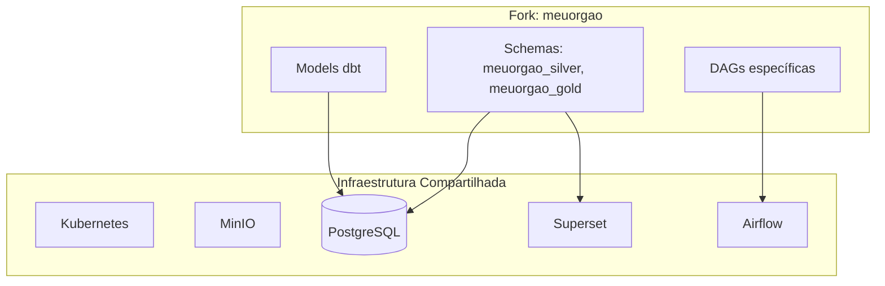

# Fork Temático

Como criar e manter um fork leve do GovHub para o contexto do seu órgão.

## Conceito

Um **fork leve** compartilha toda a infraestrutura existente (cluster K8s, MinIO, PostgreSQL, Superset, Airflow) e adiciona apenas:

- Novas DAGs de ingestão
- Novos models dbt
- Schemas PostgreSQL dedicados



## Quando Usar Fork Leve

| Cenário | Recomendação |
|---------|-------------|
| Novo órgão quer integrar suas fontes | Fork leve |
| Precisa isolamento total (compliance) | Cluster separado |
| Teste/POC com poucas fontes | Fork leve |
| Volume > 10 TB ou SLA diferente | Avaliar cluster separado |

## Passo a Passo

### 1. Fork do Repositório

```bash
# Fork de data-application-gov-hub
git clone git@github.com:GovHub-br/data-application-meuorgao.git
cd data-application-meuorgao
```

### 2. Criar Schemas PostgreSQL

```sql
-- Convenção: <fork>_silver e <fork>_gold
CREATE SCHEMA IF NOT EXISTS meuorgao_silver;
CREATE SCHEMA IF NOT EXISTS meuorgao_gold;

-- Grants para o usuário de execução do dbt/Airflow no ambiente
GRANT ALL ON SCHEMA meuorgao_silver TO <usuario_pipeline>;
GRANT ALL ON SCHEMA meuorgao_gold TO <usuario_pipeline>;
```

### 3. Criar área de dados brutos, se aplicável

```bash
mc mb govhub/bronze-meuorgao
```

### 4. Configurar dbt

```yaml
# dbt_project.yml
name: govhub_meuorgao
version: '1.0.0'

models:
  govhub_meuorgao:
    staging:
      +materialized: view
    silver:
      +materialized: table
      +schema: meuorgao_silver
    gold:
      +materialized: table
      +schema: meuorgao_gold
```

### 5. Criar DAGs

Crie DAGs em `airflow_lappis/dags/data_ingest/<origem>/` e reaproveite clientes/helpers existentes:

```python
# airflow_lappis/dags/data_ingest/meuorgao/meuorgao_fonte1_ingest_dag.py
@dag(...)
def meuorgao_fonte1_ingest_dag():
    ...
```

### 6. Criar Models

```sql
-- airflow_lappis/dags/dbt/<projeto>/models/<dominio>_dbt/silver/meuorgao_entidade.sql
{{ config(materialized='table', schema='meuorgao_silver') }}

SELECT ...
FROM {{ source('bronze', 'meuorgao_fonte1_raw') }}
```

```sql
-- airflow_lappis/dags/dbt/<projeto>/models/<dominio>_dbt/gold/meuorgao_fato.sql
{{ config(materialized='table', schema='meuorgao_gold') }}

SELECT ...
FROM {{ ref('meuorgao_entidade') }}
```

### 7. Dashboards no Superset

- Criar datasets apontando para `meuorgao_gold.*`
- Dashboards podem usar `gold.dim_orgaos` como dimensão compartilhada

## Manutenção

### Sincronizar com Upstream

```bash
git remote add upstream git@github.com:GovHub-br/data-application-gov-hub.git
git fetch upstream
git merge upstream/main
```

### Convenções

| Item | Convenção |
|------|-----------|
| Schemas PG | `<fork>_silver`, `<fork>_gold` |
| Bucket MinIO | `bronze-<fork>` |
| DAGs | `ingestao_<fork>_<fonte>` |
| Models dbt | `<fork>_<entidade>` |
| Tags Airflow | `["ingestao", "<fork>"]` |

## Forks Existentes

| Fork | Schemas | Status |
|------|---------|--------|
| `data-application-cidades` | `cidades_silver`, `cidades_gold` | Ativo |
| `data-application-minc` | `minc_silver`, `minc_gold` | Ativo |

## Referências

- [Forks Temáticos — Comunidade](../comunidade/forks.md)
- [Arquitetura de Schemas — PostgreSQL](../infraestrutura/postgres.md)
