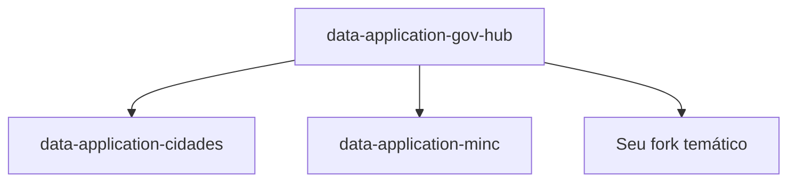

# Forks Temáticos

O GovHub BR suporta instâncias temáticas via **forks leves** do repositório principal.

## Conceito: Fork Leve

Um fork leve compartilha toda a infraestrutura (cluster K8s, MinIO, PostgreSQL, Superset, Airflow) e adiciona apenas:

- Novas DAGs de ingestão para fontes específicas
- Novos models dbt (Silver/Gold)
- Schemas PostgreSQL dedicados (ex: `cidades_silver`, `cidades_gold`)

Não requer deploy de infra separada — o isolamento é lógico via schemas PG.



## Forks Existentes

| Fork | Contexto | Status |
|------|----------|--------|
| [`data-application-cidades`](https://github.com/GovHub-br/data-application-cidades) | Dados municipais | Ativo |
| [`data-application-minc`](https://github.com/GovHub-br/data-application-minc) | Ministério da Cultura | Ativo |

## Como Criar um Fork Temático

### 1. Fork no GitHub

Fork de `GovHub-br/data-application-gov-hub` para sua organização ou para `GovHub-br/data-application-<nome>`.

### 2. Criar schemas PostgreSQL

```sql
-- Convenção: <fork>_silver e <fork>_gold
CREATE SCHEMA IF NOT EXISTS meufork_silver;
CREATE SCHEMA IF NOT EXISTS meufork_gold;
```

### 3. Adaptar fontes de dados

- Criar novas DAGs em `airflow_lappis/dags/data_ingest/<origem>/`
- Configurar conexões específicas
- Os dados raw vão para buckets MinIO dedicados (`bronze-<fork>`)

### 4. Adaptar models dbt

- Adicionar sources apontando para as staging tables
- Criar models Silver/Gold com `schema='meufork_silver'` / `schema='meufork_gold'`

### 5. Criar dashboards

- Datasets no Superset apontando para as tabelas Gold do fork
- Dashboards específicos do contexto

### 6. Manter sincronizado

```bash
# Adicionar upstream
git remote add upstream git@github.com:GovHub-br/data-application-gov-hub.git

# Sincronizar melhorias do base
git fetch upstream
git merge upstream/main
```

## Boas Práticas

- Manter a estrutura Medallion (Bronze/Silver/Gold)
- Usar convenção de schemas: `<fork>_silver`, `<fork>_gold`
- Contribuir melhorias genéricas de volta ao repo base (upstream PR)
- Documentar fontes de dados específicas
- Seguir os mesmos padrões de qualidade (dbt tests)
- DAGs devem seguir o padrão de 3 passos (extract → load → trigger dbt)
